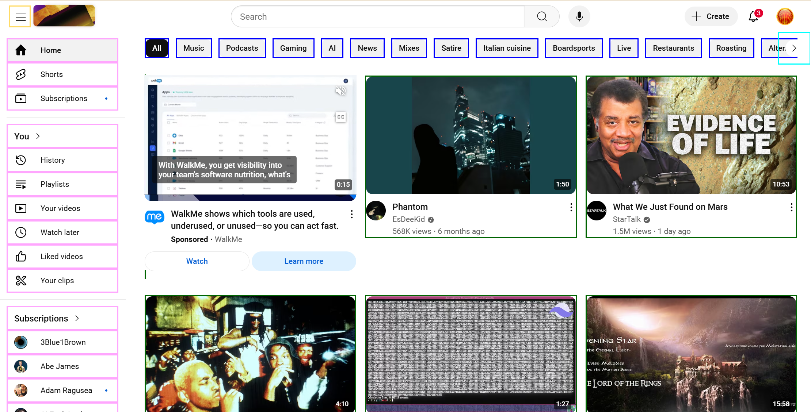
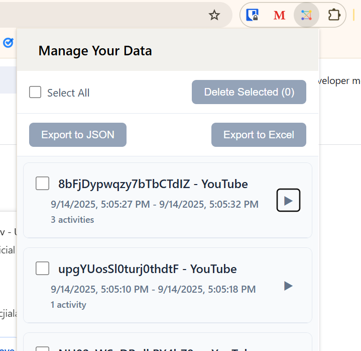
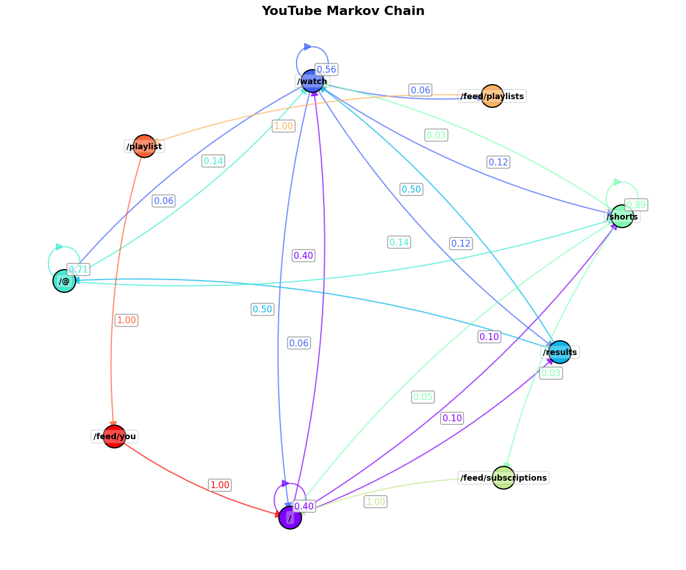

<h1 align="center">
  <br>
  <a href="http://www.amitmerchant.com/electron-markdownify"></a>
</h1>

<p align="center">
  <em><b>Markov Logger</b> is a <a href="https://developer.chrome.com/docs/extensions">Chrome Extension</a> built for researchers to track internet usage during experiments. It logs DOM events and navigations on <em>any website</em>, including single-page applications. Users can easily setup a <a href="https://firebase.google.com/docs/firestore"><b>Firebase</b></a> database with OAuth2 verification for fast installation</em>
</p>

> [!WARNING] 
> The code for this project is to be published with a research paper. Since the paper has not yet been published, the source code is still private. After publication, the code will be publicized. 

## Table Of Contents
- [About](#about)
  - [Purpose](#purpose)
  - [Example](#example)
    - [Monitoring elements](#monitoring-elements)
    - [Logging to a database](#logging-to-a-database)
    - [Analyzing results](#analyzing-results)
- [Setup](#setup)
  - [For researchers](#setup-instructions---researchers)
    - [Creating a firebase project](#creating-a-firebase-project)
    - [Setting up OAuth2](#setting-up-oauth2)
    - [Registering the extension](#registering-the-extension)
    - [Deploying](#deploying)

# About
## Purpose
Markov Logger is intended for human-computer interaction (HCI) researchers to track user behaviour on various websites. Using this data, researchers can develop a deeper understanding of the inputs and outputs of websites (eg. by observing user behaviour on YouTube, researchers can learn how inputs affect outputs of the recommendation algorithm). The extension is highly configurable, allowing specific events and navigation to be tracked on *any website*. 

## Example
### Monitoring elements
The following screen shot comes from a configuration that tracks user interactions with YouTube. Elements surrounded with coloured boxes can be monitored for clicks, hovers, or any other [DOM event](https://developer.mozilla.org/en-US/docs/Web/API/Document_Object_Model/Events), including [NavigateEvents](https://developer.mozilla.org/en-US/docs/Web/API/NavigateEvent):

<p align="center">
  
  <br />
  <i>Monitoring interactions on the YouTube home page</i>
</p>

Specifying elements and events to track is simple. Simply create a `config.json` with the following format:

```json
{
  "baseURL": "<URL TO TRACK>",
  "events": ["<event 1>, <event 2>", "...", "<event N>"],
  "paths": {
    "<PATH 1 PATTERN>": [
      {"selector": "<CSS SELECTOR FOR ELEMENT 1>", "name": "<HUMAN READABLE NAME FOR ELEMENT 1>"},
      {"selector": "<CSS SELECTOR FOR ELEMENT 2>", "name": "<HUMAN READABLE NAME FOR ELEMENT 2>"},
      ],
    "<PATH N PATTERN>": [
      {"selector": "<CSS SELECTOR FOR ELEMENT 1>", "name": "<HUMAN READABLE NAME FOR ELEMENT 1>"},
      ]
  }
}
```

For a concrete example, the following JSON file will track clicks on the like/dislike buttons on YouTube shorts and recommended videos:

```json
{
  "baseURL": "https://www.youtube.com",
  "events": ["click"],
  "paths": {
    "/shorts/:id": [
      { "selector": "#like-button[is-shorts]", "name": "Shorts Like Button" },
      {
        "selector": "#dislike-button[is-shorts]",
        "name": "Shorts Dislike Button"
      }
    ],
    "/watch?v=*": [
      {
        "selector": "like-button-view-model.ytLikeButtonViewModelHost",
        "name": "Video Like Button"
      },
      {
        "selector": "dislike-button-view-model.ytDislikeButtonViewModelHost",
        "name": "Video Dislike Button"
      }
    ]
  }
}
```

### Logging to a database
User activities are logged to a [Firebase database](https://firebase.google.com/docs/firestore). For full transparency, users can view, delete, and export their recorded activities via a popup.

<p align="center">
  
  <br />
  <i>Users can view, delete, and export their recorded activities via a popup.</i>
</p>

### Analyzing results
Once the collection period is complete, researchers can piece together the results to create get a clearer picture of how users interact with the internet. For example, a Markov Chain (hence the name) can be created to map transition probabilities between pages:

<p align="center">
  
  <br />
  <i>A Markov Chain created using user data. Nodes are pages on YouTube (eg. the <b>/watch</b> node represents all URLs of the for <b>https://www.youtube.com/watch*</b>) and edges represent probabilities of transitioning from one page to another</i>
</p>

# Setup
## Setup Instructions - Researchers
### Creating a Firebase project
<details><summary><b>Show instructions</b></summary>

Before collecting data, you will first need to create a Firebase project. 
1. [Firebase console](https://console.firebase.google.com/) and create a new project.
2. Choose a project name (anything works)
3. Create the project
4. From the home screen go to `Build > Firestore database` and click `Create database` and follow the steps. When prompted to configure, you can put the project in **production mode** and change the rules in the next step.
5. Your project should now be created. Go to the `Rules` tab for your database and replace them with the following:

```
rules_version = '2';
service cloud.firestore {
  match /databases/{database}/documents {
    // Users can only access their own data
    match /users/{userId} {
      allow read, write, delete: if request.auth != null && request.auth.uid == userId;
    }    
    // Users can only access their own subcollections
    match /users/{userId}/{document=**} {
      allow read, write, delete: if request.auth != null && request.auth.uid == userId;
    }
    match /test_users/{userId}/{document=**} {
      allow read, write, delete: if request.auth != null;
    }
  }
}
```

6. Go to `Project Overview > Project Settings > General` and scroll down to "Your apps". From here select the *Web* platform.
7. Choose a nickname for your app (again, anything works) and register the app
8. You will presented with a screen to "Add a Firebase SDK". Here you should see something like the following:

```javascript
// Import the functions you need from the SDKs you need
import { initializeApp } from "firebase/app";
import { getAnalytics } from "firebase/analytics";
// TODO: Add SDKs for Firebase products that you want to use
// https://firebase.google.com/docs/web/setup#available-libraries

// Your web app's Firebase configuration
// For Firebase JS SDK v7.20.0 and later, measurementId is optional
const firebaseConfig = {
  apiKey: "<YOUR API KEY>",
  authDomain: "<YOUR AUTH DOMAIN>",
  projectId: "<YOUR PROJECT ID>",
  storageBucket: "<YOUR STORAGE BUCKET>",
  messagingSenderId: "<YOUR MESSAGING SENDERID>",
  appId: "<YOUR APP ID>",
  measurementId: "<YOUR MEASUREMENT ID>"
};

// Initialize Firebase
const app = initializeApp(firebaseConfig);
const analytics = getAnalytics(app);
```

Make sure to copy the `firebaseConfig` object or remember how to navigate to this page, because you will need it in the next step.

9. Click "Continue to console"

</details>

### Set up your development environment
<details><summary><b>Show instructions</b></summary>

1. Clone this repo and install npm dependencies:

```
git clone git@github.com:jikaelgagnon/markov-logger-extension.git
npm install
```

2. Add your firebase config

Navigate to the `src/database/firebaseConfig.json` and paste your `firebaseConfig` object as JSON:

```json
{
  "apiKey": "<YOUR API KEY>",
  "authDomain": "<YOUR AUTH DOMAIN>",
  "projectId": "<YOUR PROJECT ID>",
  "storageBucket": "<YOUR STORAGE BUCKET>",
  "messagingSenderId": "<YOUR MESSAGING SENDER ID>",
  "appId": "<YOUR APP ID>",
  "measurementId": "<YOUR MEASUREMENT ID>"
}
```

</details>

### Registering the extension and integrating OAuth2

<details><summary><b>Show instructions</b></summary>

Please follow [this guide from Google](https://developer.chrome.com/docs/extensions/how-to/integrate/oauth).

</details>

### Deploying

<details>
<summary><b>Show instructions</b></summary>

You're now ready to deploy! Simply build the extension via

<pre><code>npm run build
</code></pre>

then load the unpacked extension into Chrome!

</details>